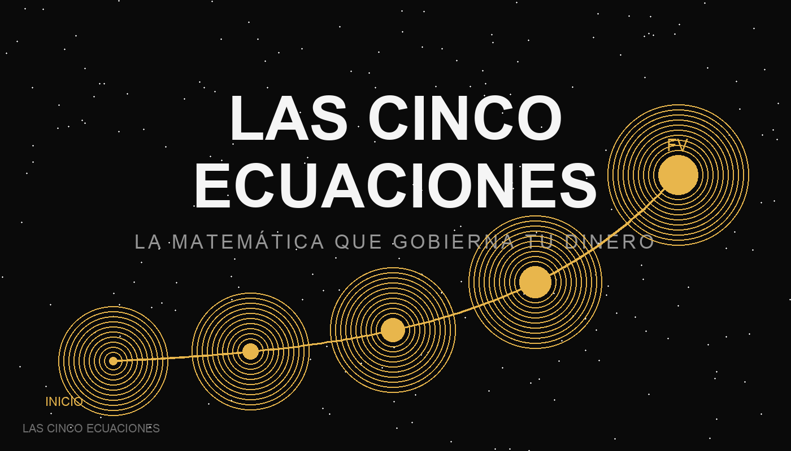
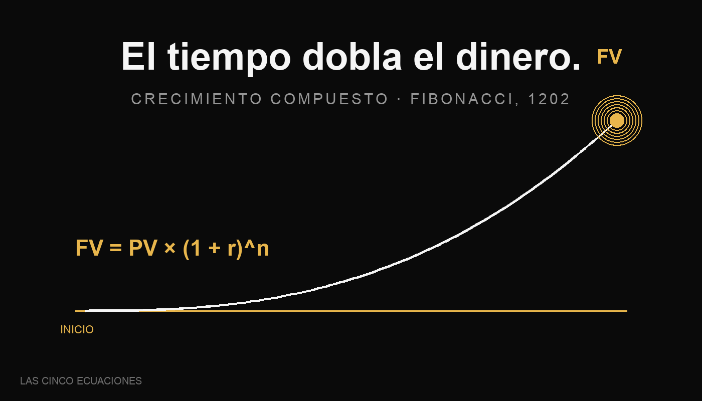
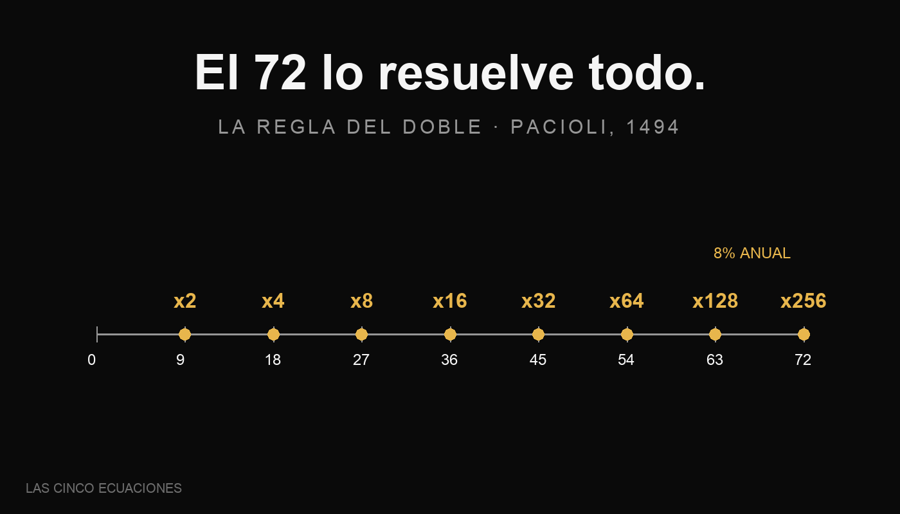
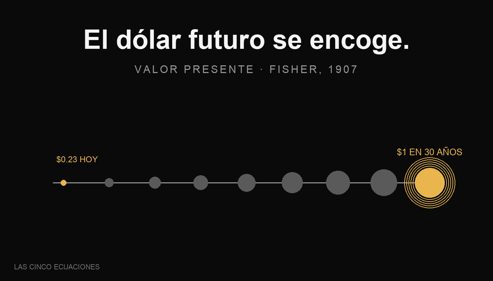
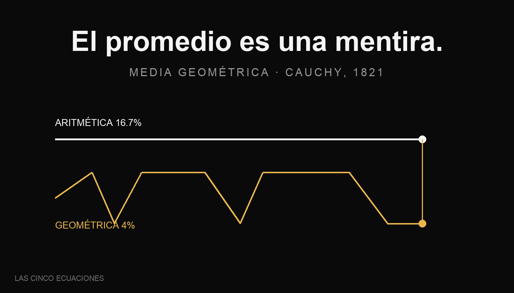
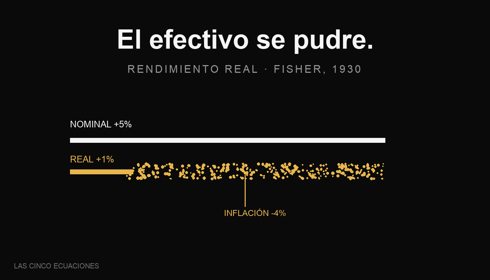

# LAS CINCO ECUACIONES QUE GOBIERNAN TU VIDA FINANCIERA (Y POR QUÉ IGNORARLAS ES UNA DECISIÓN, NO UN ACCIDENTE)

**BrAIn — Breaking AI Non-sense · The Red Queen**

> Te enseñaron aritmética en el colegio y la llamaron matemática. Luego, si tuviste suerte, te dieron "finanzas personales" como una lista de tips: ahorra más, gasta menos, invierte temprano. Nadie te dijo que debajo de cada tip hay una ecuación. Nadie te dijo que esas ecuaciones son cortas, gratis, más viejas que tu abuelo, y que deciden el resultado de casi todos los ricos antes de que nazcan. [Sí: antes de que nazcan. El exponente no espera a que madures.]

Aquí viene la verdad incómoda, la que nadie anuncia en la ceremonia de grado: **el dinero no es un misterio. Es matemática aplicada con traje.** Cada decisión que tomarás sobre un salario, una hipoteca, una inversión, una comisión, un préstamo o una pensión ya está decidida por cinco ecuaciones — las conozcas o no.

Y esta es la parte que Jordan Peterson te señalaría con el dedo: **la diferencia entre tú y la gente que maneja estas cinco ecuaciones no es inteligencia. Es responsabilidad.** Ellos cargaron con el peso de aprender lo que a ti nadie te entregó. El conocimiento no cae del cielo: se levanta del suelo, y levantarlo es un acto de voluntad.

Peterson diría que la ignorancia financiera no es inocencia — es deuda. Y la deuda, como toda deuda, se paga con intereses. [Compuestos, para más señas.]

---

## LAS CINCO ECUACIONES DE UN VISTAZO

1. **Crecimiento compuesto** — en qué se convierte un dólar con el tiempo
2. **Regla del 72** — qué tan rápido se duplica el dinero a cualquier tasa
3. **Valor presente** — cuánto vale un dólar futuro, aquí y ahora
4. **Media geométrica** — por qué el "rendimiento promedio" que te vendieron es una mentira
5. **Rendimiento real** — qué hizo tu dinero después de que la inflación comiera su parte

Cinco fórmulas. Cero jerga. Juntas explican el 90% de toda decisión financiera honesta que alguien haya tomado alguna vez.

---

## ECUACIÓN 1 — EL TIEMPO DOBLA EL DINERO (Crecimiento compuesto · Fibonacci, 1202)

La ecuación más importante del mundo del dinero se ve así:

> **FV = PV × (1 + r)^n**

Cinco símbolos. Déjame traducirlos a humano:

- **FV** = valor futuro. Lo que valdrá tu dinero después.
- **PV** = valor presente. Lo que tienes ahora.
- **r** = tasa de retorno por periodo, escrita como decimal (10% es 0.10).
- **n** = número de periodos (normalmente, años).

Se lee: *"tu dinero en el futuro es igual a tu dinero de ahora, multiplicado por uno más tu tasa, elevado a los años."*

La magia vive en ese pequeño exponente **^n**. Sin él, el dinero crecería en línea recta — aburrido, predecible, humano. Con él, crece en una curva que empieza como un susurro y termina como un grito. [Ese grito es la diferencia entre una vida de trabajo y una vida de trabajo *pagada*.]

**Ejemplo concreto.** $10,000 al 8% anual, sin agregar un centavo:

| Año | Valor |
|-----|-------|
| 10 | $21,589 |
| 20 | $46,610 |
| 30 | $100,627 |
| 40 | $217,245 |
| 50 | $469,016 |

Mira la forma. Cada década se duplica. La primera década agrega ~$12K. La última, sola, agrega ~$250K. Misma tasa. Misma apuesta inicial. **El exponente está haciendo todo el trabajo.**

Por eso un joven de 25 que invierte $10K y nunca agrega otro centavo termina a los 65 con más dinero que un cuarentón que invierte $10K **cada año** y llega a la misma meta. No es más listo. No es más rico. Solo está sosteniendo un exponente más grande.

Y aquí entra Peterson, con toda su fuerza: **el sacrificio presente es la moneda del futuro.** Diferir la gratificación — no gastar lo que podrías gastar hoy para sembrar lo que cosecharás en treinta años — es el acto de responsabilidad más básico que existe. Los psicólogos lo llaman autocontrol; Peterson lo llama *cargar tu cruz*. El héroe arquetípico no es el que gana la batalla final: es el que hizo las 10,000 pequeñas renuncias invisibles que la hicieron posible. Atlas no se queja del peso; lo sostiene. [La diferencia entre Atlas y Sísifo: Atlas sostiene el mundo, Sísifo empuja la piedra. El primero construye. El segundo solo sufre. ¿Cuál eres tú con tu dinero?]

> El talento crece lineal. El tiempo compone. Las matemáticas siempre terminarán favoreciendo al tiempo.

---

## ECUACIÓN 2 — EL 72 LO RESUELVE TODO (La regla del doble · Pacioli, 1494)

Nadie quiere hacer cuentas de `FV = PV × (1 + r)^n` de cabeza en una cena. Así que banqueros, actuarios y quants usan un atajo que existe desde 1494, cuando el fraile Luca Pacioli lo escribió en el mismo libro que le regaló a Europa la partida doble.

> **Tiempo de duplicación (en años) ≈ 72 ÷ tasa de retorno (en %)**

Eso es todo el truco. ¿Cuánto tarda el dinero en duplicarse al 6%? 72 ÷ 6 = **12 años**. ¿Al 9%? **8 años**. ¿Al 3%? **24 años**.

No es perfectamente preciso, pero es exacto dentro de uno o dos puntos porcentuales para cualquier tasa normal — y te deja hacer en tres segundos lo que a otros les tomaría una hoja de cálculo.

Con esto en la cabeza, conversaciones enteras cambian. Alguien te dice que un bono paga 4% anual → ya sabes: ese dinero se duplica cada 18 años. Alguien te dice que la inflación corre al 6% → ya sabes: los precios se duplican cada 12 años, y lo que hoy cuesta $100 costará $200 en una década. Alguien te ofrece una "segura" cuenta al 2% → ya sabes: tu dinero se duplica cada 36 años, que para la mayoría de los humanos es *una vez en la vida adulta*.

Por eso los profesionales parecen tener intuición sobrenatural con los números. No la tienen. Cargan dos atajos mentales, y este es uno.

Y aquí viene la parte que casi nadie enseña — la regla invertida. Si algo **pierde** valor a tasa r, la regla te dice qué tan rápido se reduce a la mitad:

- Inflación al 3%: tu dinero pierde la mitad de su poder de compra en **24 años**.
- Inflación al 6%: la mitad se fue en **12 años**.
- Inflación al 9%: la mitad se fue en **8 años**.

La regla funciona en ambas direcciones. Subir y bajar, crecer y pudrirse. [Peterson habla del orden y el caos como las dos fuerzas del ser. Esta regla es eso, en una servilleta: todo lo que sube puede bajar, y el que no mira la curva de bajada está ciego de un ojo.]

> La claridad mental no es un lujo: es una obligación. No puedes ordenar tu vida financiera si no puedes estimar tu futuro en tres segundos. Como dice Peterson: *limpia tu cuarto* — y tu cuarto, para bien o para mal, incluye tu balance.

---

## ECUACIÓN 3 — EL DÓLAR FUTURO SE ENCOGE (Valor presente · Fisher, 1907)

Pregunta trampa. Alguien te ofrece $1,000 — hoy o dentro de un año. ¿Cuál vale más?

Casi todos responden "hoy", y casi todos dan la razón equivocada: "porque podría gastarlos ahora". La razón real es mucho más útil, y es la razón por la que cada adquisición, póliza de seguro, pensión, hipoteca y premio de lotería del mundo se cotiza como se cotiza.

**La razón es que $1,000 hoy se pueden invertir.** Si tienes un 6% disponible, $1,000 hoy se convierten en $1,060 en un año. Así que $1,000 hoy no son iguales a $1,000 el año que viene: son iguales a ~$1,060. O, equivalentemente, $1,000 el año que viene valen solo ~$943 hoy.

Esto se llama **valor presente**, y la ecuación es simplemente la del crecimiento compuesto resuelta hacia atrás:

> **PV = FV ÷ (1 + r)^n**

Mismos cinco símbolos. Misma idea. Te preguntas: *"¿cuánto tendría que invertir hoy a tasa r para terminar con esta cantidad futura en n años?"*

Las consecuencias de esta ecuación son enormes, y explican media industria financiera:

- **Loterías.** Cuando anuncian un "premio de $300 millones", casi nunca tienen $300 millones en efectivo. Tienen lo suficiente para comprar una anualidad que pagará $300M en 30 años. En valor presente, ese premio vale **la mitad** de lo que dice el cartel. La opción de pago único no es el premio "reducido": es el honesto.
- **Seguros.** Cuando una aseguradora te cotiza una póliza de vida, está corriendo valor presente sobre pagos futuros. Si la póliza pagará $500,000 en 30 años y su retorno asumido es 5%, ese pago futuro tiene un valor presente de ~$115,000. Eso es lo que realmente están reservando. Todo lo demás es spread.
- **Hipotecas.** Cuando un banco te cotiza una hipoteca a 30 años, está calculando el valor presente de tu flujo futuro de pagos. Entender esto es por qué la misma diferencia del 1% en la tasa puede significar $80,000 más o menos durante la vida del préstamo. El banco no es codicioso: está **cobrando tiempo**.
- **Ofertas de trabajo.** Un salario de $150,000 que empieza hoy vale más que uno de $170,000 que empieza en tres años, bajo cualquier supuesto razonable de crecimiento. El valor presente es por qué "espera unos años para el aumento" suele ser una propuesta perdedora, y por qué cambiar de carrera temprano paga más de lo que parece.

La persona que conoce esta ecuación mira cada promesa futura — un cupón de bono, una oferta de equity, una pensión, un "ingreso pasivo" — y pregunta: *¿cuánto vale esto realmente hoy?* Todos los demás toman el número futuro al pie de la letra, y todos los demás pagan de más, en silencio.

Peterson diría que esta es la ecuación de la **integridad**: la capacidad de mirar una promesa — la tuya o la de otro — y calcular su valor real, sin autoengaño. La procrastinación, después de todo, es un descuento que le aplicas a tu propio futuro. Cada "lo haré mañana" es un dólar futuro que se encoge en valor presente. Y la gente que prospera es la que dejó de mentirse sobre cuánto valen sus promesas. [Decir la verdad, o al menos no mentir — empieza por no mentirte a ti mismo sobre el tiempo.]

---

## ECUACIÓN 4 — EL PROMEDIO ES UNA MENTIRA (Media geométrica · Cauchy, 1821)

Esta es la ecuación que la industria financiera no quiere particularmente que conozcas. Es corta. Es honesta. Y cambiará lo que piensas de cada anuncio de fondo que hayas visto.

Supón que un fondo te da estos retornos en tres años: **+50%, −50%, +50%.**

Pregunta: ¿cuál es tu rendimiento promedio?

La respuesta instintiva: (50 − 50 + 50) ÷ 3 = **16.7%**. ¡Se ve genial! Un 16.7% promedio suena a producto de nivel Warren Buffett.

La respuesta real: más cerca de **+7%**. Y aquí es donde se pone feo.

Tu dinero real hizo esto: $100 → $150 → $75 → $112.50. En tres años, convertiste $100 en $112.50 — una ganancia total del 12.5%, o ~4% anual compuesto. **No 16.7%.**

El número que la industria ama anunciar es la **media aritmética**, el promedio simple. El número que describe lo que realmente les pasó a tus dólares es la **media geométrica**:

> **Media geométrica = ((1 + r₁) × (1 + r₂) × ... × (1 + rₙ))^(1/n) − 1**

Multiplicas los factores de crecimiento, sacas la raíz n, y restas 1. Suena complicado; es una línea en cualquier hoja de cálculo: `=GEOMEAN(...)−1`.

La regla despiadada que está debajo:

> **La media geométrica es siempre menor o igual que la media aritmética. Son iguales solo cuando todos los años tienen exactamente el mismo retorno.**

Cuanto más volátil el retorno, más grande la brecha. Un fondo con +30% y −30% tiene media aritmética de 0% y media geométrica de ~−4.6%. "En promedio" no hiciste nada. En realidad, perdiste dinero. **La volatilidad misma tiene un costo, y ese costo tiene nombre: variance drag** (arrastre de varianza).

Por eso un 8% "suave" vale mucho más que un 8% "salvaje", aunque el número del folleto sea idéntico. Por eso los fondos de cobertura que oscilan fuerte a menudo decepcionan a sus inversores aunque sus pitch decks luzcan brillantes. Y por eso cualquier reporte de rendimiento honesto muestra el CAGR (tasa de crecimiento anual compuesta) — que es la media geométrica por otro nombre.

Una vez que sabes esto, miras el "rendimiento promedio" de cada fondo con una pregunta extra en la cabeza: *¿aritmética o geométrica?* Y si no te la quieren responder, la respuesta casi siempre es la que no quieren que compares.

Peterson lo pondría en términos de **mapa y territorio**: el promedio aritmético es el mapa bonito que te vende el corredor; la media geométrica es el territorio donde vive tu dinero. Y confundir el mapa con el territorio — creerle a la cifra que te halaga en vez de a la que te describe — es exactamente el tipo de autoengaño que Peterson identifica como la raíz del sufrimiento evitable. La realidad no negocia: se enfrenta. [Cauchy publicó la desigualdad aritmético-geométrica en 1821. Dos siglos después, sigue siendo el arma más afilada contra el marketing financiero.]

---

## ECUACIÓN 5 — EL EFECTIVO SE PUDRE (Rendimiento real · Fisher, 1930)

Hay una ecuación final, y es la que la mayoría de la gente nunca piensa — que es exactamente por qué se los come.

Pones dinero en una cuenta de ahorros que paga 4%. La inflación es 3%. ¿Qué hizo tu dinero en realidad?

La respuesta intuitiva: "creció 4%". La respuesta correcta: creció ~1% en poder de compra. Tus dólares se multiplicaron, pero cada dólar ahora compra menos. Tu dinero creció nominalmente y se encogió en términos reales, casi simultáneamente.

> **Rendimiento real = ((1 + rendimiento nominal) ÷ (1 + inflación)) − 1**

Divides 1 más tu retorno entre 1 más la inflación, y restas 1. O, para una aproximación rápida que funciona bien con números pequeños:

> **Rendimiento real ≈ rendimiento nominal − inflación**

Esa es la ecuación. Pero la mentalidad que te obliga a adoptar es el verdadero regalo:

- Un "bono garantizado del 5%" durante 4% de inflación es un retorno del **1%**, no del 5%.
- Una "cuenta corriente al 0%" durante 3% de inflación es un retorno de **−3%**. Te están pagando por perder dinero, lentamente.
- Un mercado que promedia 10% nominal durante 3% de inflación es un retorno real del **7%**. Ese 7% es el número que de verdad importa.

Esta ecuación es tan silenciosamente importante porque **la inflación es la única partida de tu vida financiera que nunca ves en ningún estado de cuenta.** Tu saldo sube. Tu tarjeta se paga. Todo se ve bien. Mientras tanto, un impuesto invisible corre en segundo plano, quitándote dos, tres, cinco por ciento de tu poder de compra cada año.

Los ricos no ganan necesariamente más retorno nominal que los demás. Solo se aseguran de que su retorno nominal esté cómodamente por encima de la inflación, siempre. Todos los demás se vuelven más pobres en silencio mientras su saldo bancario sube.

> **El dinero que no invertiste no está "a salvo". Está siendo gravado por la inflación a una tasa a la que nunca consentiste.**

Y aquí Peterson te agarra del hombro con la frase más incómoda de todas: **la inacción es una decisión.** La vida no premia la neutralidad. El que no elige, ya eligió — eligió el statu quo, eligió la cuenta al 0%, eligió que la inflación le coma el sueldo mientras "esperaba el momento perfecto". El coraje no es solo hacer cosas difíciles: es soportar la incomodidad de hacer algo *ahora* en vez de la comodidad de no hacer nada *siempre*.

Aprender a pensar en términos reales en vez de nominales es el interruptor mental que separa a la gente que entiende el dinero de la gente que solo lo maneja. [Y sí: el que "guarda bajo el colchón" no está siendo prudente. Está financiando su propia decadencia, dólar a dólar.]

---

## PONIENDO LAS CINCO ECUACIONES JUNTAS

Cada ecuación por sí sola es una herramienta. Juntas, son una lente — y te dejan ver a través de casi cualquier afirmación financiera que encuentres.

| Ecuación | Qué hace por ti |
|----------|----------------|
| Crecimiento compuesto | Entender por qué el tiempo vale más que el talento |
| Regla del 72 | Estimar cualquier duplicación en tres segundos |
| Valor presente | Cotizar una promesa futura con honestidad |
| Media geométrica | Leer un reporte de fondos sin que te engañen |
| Rendimiento real | Separar lo nominal de lo real al instante |

Cinco ecuaciones. Dos son solo álgebra reordenada. Una es un atajo mental de 1494. Las cinco caben en una servilleta.

Y te permiten hacer cosas que casi nadie a tu alrededor puede hacer:

- Estimar cualquier tiempo de duplicación en tres segundos
- Leer la hoja de rendimiento de un fondo sin que te engañen
- Cotizar una promesa futura con honestidad
- Separar instantáneamente retornos nominales de reales
- Entender por qué el tiempo es el activo más valioso que posees

## POR QUÉ ESTO IMPORTA (EL DRAGÓN QUE NO VES)

La industria financiera no quiere que seas malo en matemáticas. Quiere que seas **selectivamente malo**: lo suficientemente bueno para firmar contratos y pagar comisiones, no lo suficientemente bueno para notar lo que los contratos están haciendo.

- Una comisión de gestión del 2% suena a error de redondeo. Corre por la ecuación de crecimiento compuesto durante 40 años y **se come cerca de la mitad de tu riqueza final**. No lo notaste porque el 2% no se siente como la mitad.
- Un "producto de ahorro garantizado al 5%" durante 4% de inflación suena seguro. Corre por la ecuación de rendimiento real y ganaste 1%. No lo notaste porque 5% sonaba a mucho.
- Un "fondo de cobertura con 20% de rendimiento promedio" suena espectacular. Pide la media geométrica en vez de la aritmética y a menudo encuentras un número mucho más aburrido. No lo notaste porque solo anunciaron el halagador.

Esto no es una conspiración. Es una característica. Toda industria que vende complejidad depende de que sus clientes no puedan hacer las matemáticas subyacentes. Seguros, hipotecas, fondos, pensiones, tarjetas de crédito: todos funcionan mejor cuando el cliente confía en el resumen del vendedor en vez de correr la ecuación él mismo.

Las cinco ecuaciones de arriba son toda la defensa. No contra el fraude, que es raro — sino contra el problema mucho más común de los malos negocios silenciosos disfrazados de lenguaje tranquilizador.

## LO QUE DE VERDAD IMPORTA

Juntemos todo en una imagen.

**El dinero no es una fuerza misteriosa. Es un conjunto pequeño de ecuaciones que nunca te entregaron del todo.** La gente que parece rica o sabia con el dinero no está dotada psíquicamente: está corriendo las mismas cinco fórmulas que acabas de leer, una y otra vez, sobre cada decisión que cruza su escritorio. Ese es todo el "secreto".

- El crecimiento compuesto explica por qué el tiempo vale más que el talento.
- La regla del 72 explica por qué los profesionales estiman cualquier cosa en segundos.
- El valor presente explica por qué toda promesa futura vale menos de lo que parece.
- La media geométrica explica por qué la mayoría de los rendimientos anunciados están inflados en silencio.
- El rendimiento real explica por qué la seguridad nominal suele ser pérdida real.

Ninguna de estas fórmulas está oculta. Ninguna requiere un título. Ninguna cuesta nada. Todas son más viejas que tus abuelos. Fueron escritas hace siglos por matemáticos y escribanos que nunca imaginaron que su trabajo seguiría gobernando la riqueza del mundo 500 años después.

El hábito mental más útil que puedes construir es este: **cuando enfrentes una afirmación financiera, antes de sentir nada, pregúntate cuál de las cinco ecuaciones la gobierna — y corre el número.**

> **Los ricos no son personas que vencen las ecuaciones. Son personas que nunca discutieron con ellas.**

Y aquí está la pregunta que vale la pena contemplar — la pregunta que Peterson te dejaría flotando en el aire, con esa mezcla de compasión y severidad que lo caracteriza:

Si cinco ecuaciones cortas — todas gratis, todas públicas, todas más viejas que cualquier banco de la Tierra — deciden la mayor parte de tu vida financiera, y llevas años navegando el dinero sin ellas, entonces la pregunta honesta no es *"¿por qué no entiendo de finanzas?"*

Es:

> **"¿Cuánto me ha costado ya no saber estas cinco cosas — y cuánto más estoy dispuesto a dejar que me cueste?"**

El conocimiento no te hace rico. El conocimiento te hace **responsable** — y la responsabilidad, bien cargada, es lo único que la vida termina pagando con interés.

La matemática está en la servilleta. El resto depende de ti.

---

*BrAIn — Breaking AI Non-sense. Artículo inspirado en "The Five Equations That Quietly Run Your Entire Financial Life" de @lumenxbt (X, jul 2026), reescrito en español con lente de responsabilidad individual — la lectura que Jordan Peterson haría de las finanzas. Ecuaciones originales: Fibonacci (1202), Pacioli (1494), Fisher (1907, 1930), Cauchy (1821).*

*Si este artículo te cambió la forma de ver el dinero, sigue a BrAIn — cada pieza toma un tema y lo rompe hasta el fondo.*
