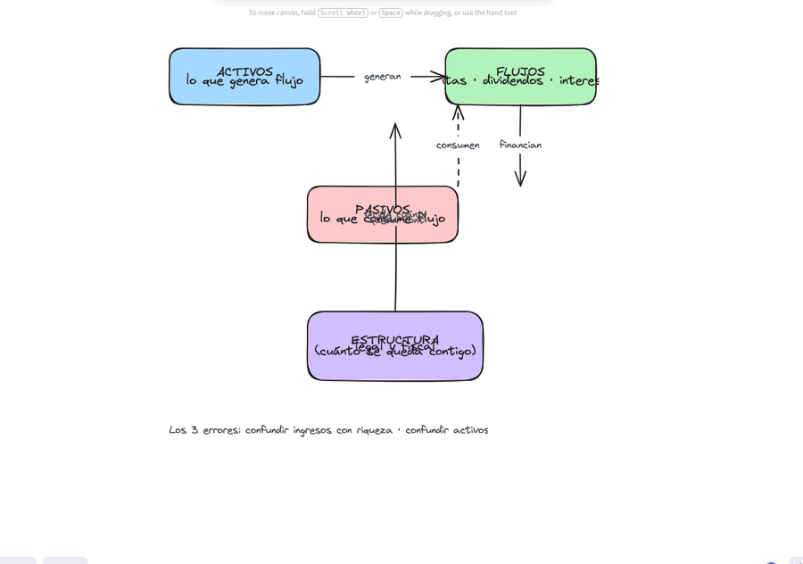

# PASO 1 — EDUCACIÓN PATRIMONIAL

> *"El lenguaje y los criterios con los que se toman las grandes decisiones financieras."*
> Objetivo: dejar de improvisar. No se puede diseñar un plan en un idioma que no se habla.

## MARCO: EL JUEGO REAL DE LA RIQUEZA

La riqueza no se construye "ahorrando" ni "invirtiendo en lo que todos invierten".
Se construye entendiendo 4 piezas que forman un sistema:

**Los 3 errores del principiante (y su corrección):**

| Error | Corrección |
|---|---|
| Confundir ingresos con riqueza | La riqueza = lo que queda y trabaja, no lo que entra |
| Confundir activos con "cosas que suben" | Activo = lo que genera flujo. Tu casa no paga tu vida |
| Confundir diversificación con dispersión | 20 posiciones sin tesis = 20 apuestas, no un sistema |

## EJERCICIO 1.1 — AUDITORÍA DE VOCABULARIO

Marca con honestidad cuáles puedes definir en 1 frase:

- [ ] Rentabilidad vs rendimiento
- [ ] Liquidez vs solvencia
- [ ] Activo vs pasivo
- [ ] Riesgo vs volatilidad
- [ ] Diversificación vs concentración
- [ ] Valor vs precio
- [ ] Tasa real vs tasa nominal
- [ ] Fideicomiso vs testamento

> **Entregable 1:** escribe en una línea la definición de los 4 que menos domines.
> Son tu plan de estudio de las próximas 2 semanas.

## EJERCICIO 1.2 — TU MODELO MENTAL ACTUAL

Responde en 5 minutos, sin editar:

1. ¿Qué es para ti "invertir"? (¿comprar cosas que suben? ¿generar flujo? ¿proteger?)
2. ¿De dónde sacaste esa definición? (padres, moda, experiencia propia, un curso)
3. ¿Qué decisión financiera de tu pasado cambiarías con lo que sabes hoy?

> **Entregable 2:** 3 frases. Este ejercicio revela el "sistema operativo" con el
> que has decidido hasta ahora.

## FRAMEWORK: LOS CRITERIOS DE DECISIÓN

Toda decisión patrimonial se evalúa con 5 criterios (el "pentágono"):

1. **Rentabilidad esperada** — ¿cuánto espero ganar (neto, no bruto)?
2. **Riesgo asumido** — ¿cuánto puedo perder y en qué escenario?
3. **Liquidez** — ¿cuándo puedo sacar el dinero y a qué costo?
4. **Horizonte** — ¿en cuánto tiempo necesito este dinero?
5. **Fiscalidad** — ¿cuánto se queda el fisco de lo que gano?

> Regla: NUNCA evalúes una oportunidad con menos de 3 de estos criterios.
> "Es buen negocio" sin estos 5 números no es una decisión, es una corazonada.

## ENTREGABLE FINAL DEL PASO 1

Escribe 5 frases: "Yo invierto para ______. Mi definición de activo es ______.
Mi mayor error pasado fue ______. A partir de hoy evalúo con: rentabilidad,
riesgo, liquidez, horizonte y fiscalidad. Mi brecha de conocimiento principal es ______."

→ Pasa al Paso 2 solo cuando las 5 frases estén escritas.
